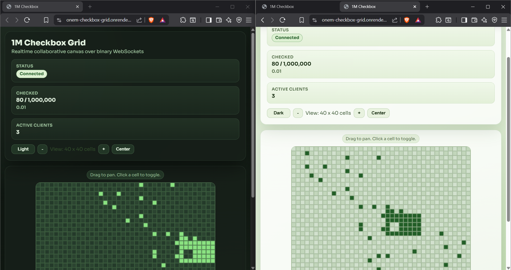

# 1M Checkbox Grid

Realtime collaborative checkbox canvas with 1,000,000 cells, powered by a compact bitmask and binary WebSockets.

This project is designed to show how large shared state can be handled efficiently in the browser and synchronized live across many clients.

## Live Demo

- URL: https://onem-checkbox-grid.onrender.com/

## Screenshot

## What This Project Demonstrates

- Efficient state storage using a bitmask instead of boolean arrays.
- Binary WebSocket protocol for compact network payloads.
- Canvas-based rendering for very large grids.
- Live multi-client synchronization.
- Responsive UI with zoom, pan, and dark mode.

## Why Bitmask

1,000,000 checkbox values can be represented in:

- Bitmask: 1,000,000 bits = 125,000 bytes (about 122 KB)
- Typical JSON boolean array: several MB

The memory and bandwidth savings are the core reason this architecture works smoothly.

## Architecture Overview

### Server

- Node.js + Express + ws
- Maintains the shared bitmask in memory
- Accepts toggle messages from clients
- Broadcasts patch updates and stats
- Sends full snapshot to newly connected clients

### Client

- Vanilla HTML/CSS/JS
- Renders a zoomed window of the 1M grid on a canvas
- Supports click-to-toggle, drag-to-pan, zoom controls
- Supports light/dark theme toggle with persistence

### Shared Protocol

Shared constants and binary encode/decode helpers are used by both client and server.

## Message Protocol

- SNAPSHOT (1): full bitmask payload for initial sync
- PATCH (2): single cell update `{index, value}`
- STATS (3): checked count, total, and connected clients
- TOGGLE (10): client request to toggle a single cell
- RESET (11): protocol-level reset message support

## Controls

- Click a cell: toggle checkbox state
- Drag on canvas: pan across the grid
- + / - buttons: zoom in or out (change visible cell window)
- Center: move viewport to center region
- Theme button: switch light/dark mode

## Project Structure

- server/index.js: Express + WebSocket server and shared bitmask state
- shared/protocol.js: message type constants and binary helpers
- client/main.js: canvas rendering, websocket client, interaction logic
- client/styles.css: responsive UI and theme styling
- index.html: app shell markup
